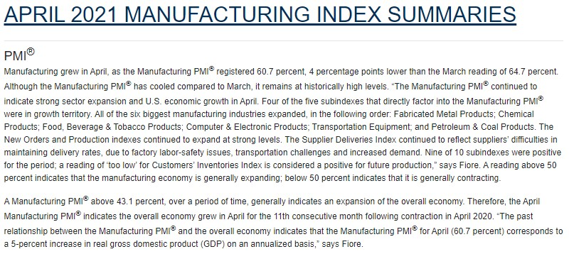
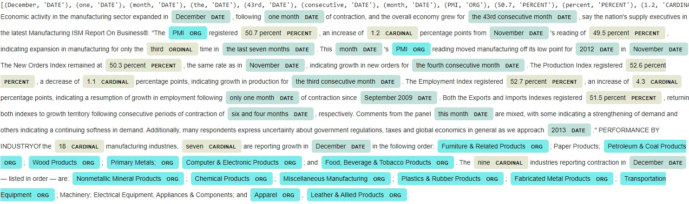
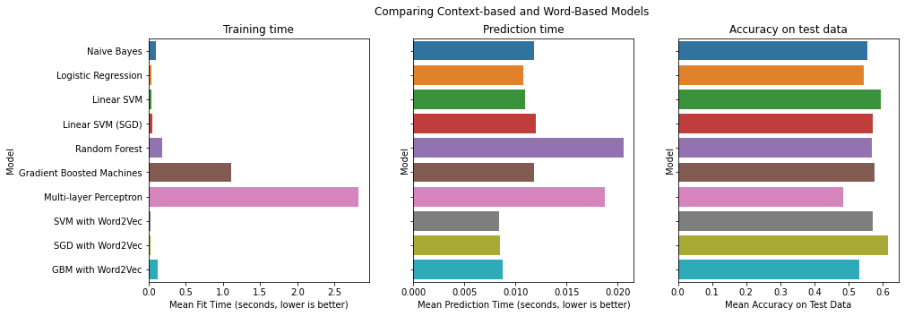
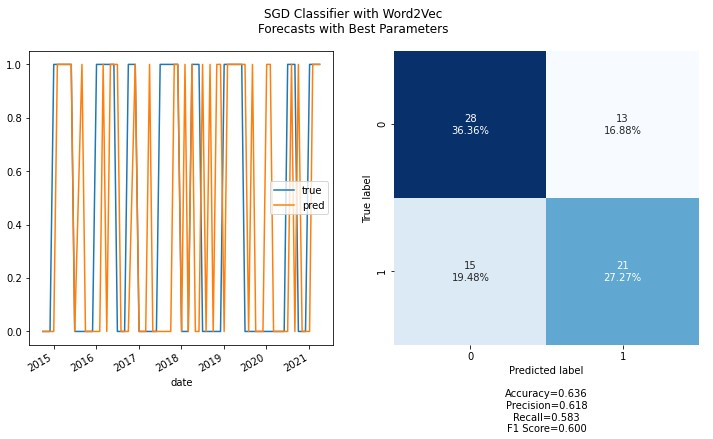

# Forecasting Business Cycle Direction using NLP

*Business cycle forecasting is valuable to businesses so that they can make informed business decisions. Thousands of approaches exist for business cycle forecasting--including qualitative models and quantitative models--but which ones are useful?. There may be value in using a model that examines public data in a novel way. Can we use a natural language processing model to analyse forward-looking statements by supply chain managers to forecast the business environment for the upcoming quarter?*

## 1. Data

The US GDP data is released every three months. The ISM releases their Report on Business survey results on the first business of every month.  Can we use the textual data in the monthly ISM report to forecast the direction of change in GDP growth relative to the previous quarter?

> * [Dataset: ISM Report On Business®](https://ismrob.org/)
> 

The textual data for this analysis is from the Institue for Supply Management's (ISM) Report on Business. This report has been published on the first day of the month since the 1940's under a few different names--the most-used being the "PMI", or "Purchasing Managers Index".

Confusingly, other research firms release data with the name "PMI", but this notebook will use the ISM's PMI report as it has the longest history.

> * [Target: US GDP](https://fred.stlouisfed.org/series/GDPC1/)

We express the target as the sign of the change in the GDP growth--either positive, negative. As GDP growth is the change in GDP, the target is the sign of the change of the change in GDP. This can also be described as the sign of the 2nd-order rate of change, or the acceleration, of GDP.

By choosing the target this way, this frames the problem we are solving as a binary classification problem.

The image shows the change in GDP. The target variable, as depicted in the image, is the slope of the line.

## 2. Method

The target data is easily sourced from the the FRED API.

The features data cannot be sourced directly from the the ISM due too licensing limitations. As a workaround, a decent-sized portion of the data set can be sourced from [press releases on prnewswire.com](https://www.prnewswire.com/news/institute-for-supply-management/)

The websites that hold the data of interest are dynamic websites making extensive use of java script to display the content, so scraping with [BeautifulSoup](https://www.crummy.com/software/BeautifulSoup/bs4/doc/#) alone will not work. For this task, we use [Selenium](https://selenium-python.readthedocs.io/) to render the dynamic webpage, then use BeautifulSoup to parse the relevant text from the as-rendered html source.

### Gather the data

1. Render data with Selenium 
2. Scrape the rendered text with BeautifulSoup
3. Parse the html source into the five sections of interest (five corpuses)

### Normalize each corpus

1. Strip HTML tags
2. Remove accented charecters
3. Change text to lowercase
4. Remove extra line breaks
5. Leematize text
6. Remove special charecters and digits
7. Remove extra whitespace
8. Remove stop words

### Tokenize and vectorize or feature-engineer each corpus

1. For "Summary" and "What Respondants are Saying" corpuses, use TFIDF vectorizer or Word2Vec Vectorizer. 
2. For corpus regarding commodities, use CountVectorizer.

### Concatenate the five feature matrices to make the feature matrix for the model

### Make predictions using [Sci-kit Learn](https://scikit-learn.org/stable/index.html) models
1. [Multinomial Naive Bayes](https://scikit-learn.org/stable/modules/generated/sklearn.naive_bayes.MultinomialNB.html#sklearn.naive_bayes.MultinomialNB)
2. [Logistic Regression](https://scikit-learn.org/stable/modules/generated/sklearn.linear_model.LogisticRegression.html?highlight=logistic%20regression#sklearn.linear_model.LogisticRegression)
3. [Linear SVM](https://scikit-learn.org/stable/modules/generated/sklearn.svm.LinearSVC.html?highlight=linear%20svm#sklearn.svm.LinearSVC)
4. [Stochastic Gradient Descent](https://scikit-learn.org/stable/modules/generated/sklearn.linear_model.SGDClassifier.html?highlight=sgd#sklearn.linear_model.SGDClassifier)
5. [Random Forest](https://scikit-learn.org/stable/modules/generated/sklearn.ensemble.RandomForestClassifier.html?highlight=random%20forest#sklearn.ensemble.RandomForestClassifier)
6. [Gradient Boosted Machines](https://scikit-learn.org/stable/modules/generated/sklearn.ensemble.GradientBoostingClassifier.html?highlight=gradientboostingclassifier#sklearn.ensemble.GradientBoostingClassifier)
7. [Multilayer Perceptron](https://scikit-learn.org/stable/modules/generated/sklearn.neural_network.MLPClassifier.html?highlight=mlpclassifier#sklearn.neural_network.MLPClassifier)

## 3. Data Cleaning 

As the data is web-scraped from a news release website, the input data format is html and javascript source code. The relevant text is buried in the source code and requires extensive cleaning before it can be preprocessed for the models.

The data cleaning steps are outlined in the above section under "Gather the data" and "Normalize each corpus".

## 4. EDA

[EDA Report](https://colab.research.google.com/drive/1NTY77rXo3MxYBcSUvGfdl5AaaT5bI-G-#scrollTo=tZv8TJCbgw-T&uniqifier=10)

The EDA consisted mainly to confirm that the text was clean enough to be tokenized properly and serve as inputs into the next steps in the pipeline. In the image, we can see that a Named Entity Recognition model can pick out the named entities in the cleaned text.

## 5. Algorithms & Machine Learning

[Feature Engineering Notebook](https://colab.research.google.com/drive/1NTY77rXo3MxYBcSUvGfdl5AaaT5bI-G-#scrollTo=M8NODhN2L8ZA&uniqifier=10)

[ML Notebook](https://colab.research.google.com/drive/1NTY77rXo3MxYBcSUvGfdl5AaaT5bI-G-#scrollTo=LaA6HRShHnGr&uniqifier=10)

I tested the feature-engineered dataset on 7 different algorithms that were well-suited for the dataset and the modelling goals and two types of text preprocessing. 

The SGD model with context-based preprocessing is top-ranked and Linear SVM model with word-based preprocessing is the second-ranked. Training time and prediction time are similar enough (generally within one order of magnitude) and all of their magnitudes are suitable for the monthly frequency of the training and predictions.

>***NOTE:** I chose accuracy as the performance metric because there are no anomalies in data that warrant the extra complexity--relative to accuracy--of the other metrics and because many stakeholders can best understand--and make business decisions--using accuracy.*

**Selection: SGD model with context-based preprocessing**

This algorithm is best described by the first paragraph of its documentation:

> Linear classifiers (SVM, logistic regression, etc.) with SGD training.

>This estimator implements regularized linear models with stochastic gradient descent (SGD) learning: the gradient of the loss is estimated each sample at a time and the model is updated along the way with a decreasing strength schedule (aka learning rate). ...For best results using the default learning rate schedule, the data should have zero mean and unit variance.

Despite no guarantee that the vectorized features have zero mean or unit variance, this model performed best among those tested.

## 8. Future Improvements

### Small dataset

The historical dataset spans over 70 years, but the textual data in this analysis only spans nine years.

While the historical numerical data in this data series are quite easy to find, as id the newest full release. However, the historical full text data series is quite difficult to find on the public web. Due to licensing and copyright issues, as well as limited access to the archival data, this analysis only considered textual data that could be found still published on a public news outlet's website.

*Further work: license the older data for research purposes, or find an institution that will share thier access to the archival data text.*

### Model has no memory of previous data in the time-series 
These models use only the most recent data as features when predicting the gdp_growth_direction. It may be useful for the models if they could learn from the features and targets of previous periods.

*Further work: Add creation of rolling windows to the preprocessing pipeline.*

### Some advanced word embeddings are absent from the final model

The word embeddings compared in this analysis are well-studied and easy to understand and explain. However, this means that the newest vectorizer compared here was first published in 2013 (Word2Vec). There are many newer vectorizers that may have performace improvements. Candidates for next comparsions include [GloVe (2014)](https://www.aclweb.org/anthology/D14-1162/) and [fastText (2016)](https://arxiv.org/abs/1607.04606v2) because they already have open-source python implementations. These two vectorizers have different approaches to making the word embeddings. It could be interesting to see if the novel approaches result in better performance. 

*Further work: Add FastText and GloVe word embeddings to the comparison*

### Topic embeddings are absent from the final comparison

Topic embedding were considered in the data exploration but were left out of the final comparision as combining these embeddings into a model with word2vec embeddings would be computationally costly on a single machine. By adapting code in this notebook for distributed computing, a larger model consisting of topic embeddings along with more advanced word embedding can be evaluated.

*Further work: Adapt the code for distrubuted computing to compute the performance of larger models containing words embeddings, as well as topic embeddings and content-embeddings.*

## 9. Credits

Thanks to the open source devs who maintain Sci-kit Learn, BeautifulSoup, and Selenium; and to Shmuel Naaman for being an amazing Springboard mentor.

