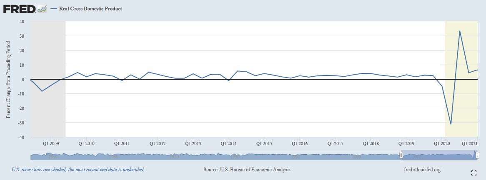

# Forecasting Business Cycle Direction using NLP

*Business cycle forecasting is valuable to businesses so that they can make informed business decisions.Thousands of approaches exist for business cycle forecasting--including qualitative models and quantitative models--but which ones are useful?.There may be value in using a model that examines public data in a novel way. Can we use a natural language processing model to analyse forward-looking statements by supply chain managers to forecast the business environment for the upcoming quarter?*

## 1. Data

The US GDP data is released every three months. The ISM releases their Report on Business survey results on the first business of every month.  Can we use the textual data in the monthly ISM report to forecast the direction of change in GDP growth relative to the previous quarter?

> * [Dataset: ISM Report On Business®](https://ismrob.org/)
> 

The textual data for this analysis is from the Institue for Supply Management's (ISM) Report on Business. This report has been published on the first day of the month since the 1940's under a few different names--the most-used being the "PMI", or "Purchasing Managers Index".

Confusingly, other research firms release data with the name "PMI", but this notebook will use the ISM's PMI report as it has the longest history.

> * [Target: US GDP](https://fred.stlouisfed.org/series/GDPC1/)

We express the target as the sign of the change in the GDP growth--either positive, negative. As GDP growth is the change in GDP, the target is the sign of the change of the change in GDP. This can also be described as the sign of the 2nd-order rate of change, or the acceleration, of GDP.

By choosing the target this way, this frames the problem we are solving as a binary classification problem.

The image shows the change in GDP. The target variable, as depicted in the image, is the slope of the line.

## 2. Method

The target data is easily sourced from the the FRED API.

The features data cannot be sourced directly from the the ISM due too licensing limitations. As a workaround, a decent-sized portion of the data set is can be sourced from [press releases on prnewswire.com](https://www.prnewswire.com/news/institute-for-supply-management/)

The websites that hold the data of interest are dynamic websites making extensive use of java script to display the content, so scraping with [BeautifulSoup](https://www.crummy.com/software/BeautifulSoup/bs4/doc/#) alone will not work. For this task, we use [Selenium](https://selenium-python.readthedocs.io/) to render the dynamic webpage, then use BeautifulSoup to parse the relevant text from the as-rendered html source.

### Gather the data

1. Render data with Selenium 
2. Scrape the rendered text with BeautifulSoup
3. Parse the html source into the five sections of interest (five corpuses)

### Normalize each corpus

1. Strip HTML tags
2. Remove accented charecters
3. Change text to lowercase
4. Remove extra line breaks
5. Leematize text
6. Remove special charecters and digits
7. Remove extra whitespace
8. Remove stop words

### Tokenize and vectorize or feature-engineer each corpus

1. For "Summary" and "What Respondants are Saying" corpuses, use TFIDF vectorizer or Word2Vec Vectorizer. 
2. For corpus regarding commodities, use CountVectorizer.

### Concatenate the five feature matrices to make the feature matrix for the model

### Make predictions using Scikit Learn models
1. Naive Bayes
2. Logistic Regression
3. Linear SVM
4. Stochastic Gradient Descent
5. Random Forest
6. Gradient Boosted Machines
7. Multilayer Perceptron

## 3. Data Cleaning 

As the data is web-scraped from a news release website, the input data format is html and javascript source code. The relevant text is buried in the source code and requires extensive cleaning before it can be preprocessed for the models.

## 4. EDA

[EDA Report](https://colab.research.google.com/drive/13dcDkM-_T9a69Mjl5dngUVlCGvbD4wvi)

* Even without feature engineering, some features were predictive of the student's responses.  

In in the left plot, 300 milliseconds in the mean time elapsed while answering the previoius question is a statisically significant seperation between the two predictions. In the right plot, 9 days in the mean user account age is a statisically significant seperation between the two predictions.

## 5. Algorithms & Machine Learning

[Feature Engineering Notebook](https://colab.research.google.com/drive/1NkraGuA-_JZLfqhZdK_H7DKizTBk_4bm)

[ML Notebook](https://colab.research.google.com/drive/11YpddoKfSZ2cPrrB-lrBa1guXZg1c5Q4)

I chose to work with [Sci-kit Learn](https://sklearn.org/) and a Python-implemented [Bayesian Optimization library](https://github.com/fmfn/BayesianOptimization) for selecting and training my model. I tested the feature-engineered dataset on 5 different algorithms that were well-suited for the dataset and the modelling goals. The LightGBM and Random Forest algorithms both scored the best but a comparision of the learning rates shows that LightGBM learns much faster than Random Forest, in terms of both fit time and number of samples.

>***NOTE:** I choose ROC AUC as the scoring metric because the models will be on this metric if entered into the Kaggle competition. The ROC AUC useful when we want to evaluate a model by considering the probabilities it assigns to its predictions, rather than just the predictions only*

**Selection: LightGBM Algorithm**

This algorithm is best descrided by the first paragraph of its documentation:

> LightGBM is a gradient boosting framework that uses tree based learning algorithms. It is designed to be distributed and efficient with the following advantages:
> 
> * Faster training speed and higher efficiency.
> 
> * Lower memory usage.
> 
> * Better accuracy.
> 
> * Capable of handling large-scale data.

While modeling this data, all of those claims were shown to be accurate.

## 8. Future Improvements

* In the future, I would love to integrate an API where a student or teacher, or their app, can query the model with information about some kind of content and receive the prediction without having to use a Jupyter notebook inteface.

* Due to RAM constraints on google colab, I had to train a 1% sample of the original 100 million sample dataset. Without resource limitations, I would love to train on the full dataset. Preliminary tests showed that the bigger the training size, the higher the ROC AUC for most of the models--except for LightGBM which did not required less than 40000 samples to reach its peak score. 

## 9. Credits

Thanks to the open source devs who maintain Sci-kit Learn, and Shmuel Naaman for being an amazing Springboard mentor.

